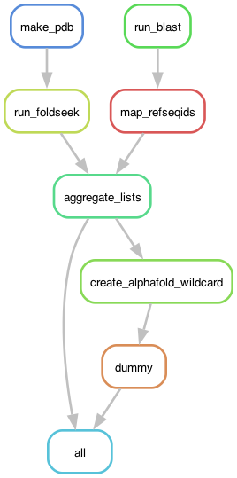

# gene-family-cartography
embedding proteins into feature spaces for computational exploration

## Purpose
The relationship between protein sequence, structure, and function has only been thoroughly investigated for a handful of gene families.  
This repo takes an agnostic approach to characterizing groups of similar proteins using feature embedding spaces.  

Our pipeline starts with user-provided protein(s) of interest and searches the available sequence and structure databases for matches.  
Using the full list of matches, we can build a "map" of all the similar proteins and look for clusters of proteins with similar features.  
Overlaying a variety of different parameters such as taxonomy, sequence divergence, and other features onto these spaces allows us to explore the features that drive differences between clusters.

## Directory Structure
- [Snakefile](Snakefile): the Snakemake pipeline that orchestrates this repo's functions.
- [config.yml](config.yml): default config file for the pipeline.
- [envs/cartography.yml](envs/cartography.yml): the conda environment for this repo.
- [ProteinCartography/](ProteinCartography/): helper scripts that are called by the Snakemake pipeline, pip-installable and importable in Python.
- [examples/](examples/): example output files.

## Pipeline Overview
This repo cotains a Snakemake pipeline that takes input `.fasta` and `.pdb` files of interest.
The rulegraph for this pipeline is as follows:  


The steps of the pipeline have the following functionality:

### Protein Folding
0. Fold input FASTA files using ESMFold.
    - The workflow starts with input FASTA files, one entry per file, with a unique ID.
    - If a matching PDB file is not provided, the pipeline will use the ESMFold API to generate a PDB.

==TODO==  
- [ ] Check the quality of the input structure and warn user if it's of low quality.
- [ ] Provide the ability to download files from the PDB.
- [ ] Handle multi-chain PDB files appropriately.

### Protein Search
1. Search the Alphafold databases using queries to the FoldSeek webserver API for each provided `.pdb` file.  
    - Currently, we're limited to a maximum of 1000 hits per protein.  
    - We should look for ways to increase this number of hits, potentially by hosting the full AlphaFold database ourselves and building a simple API to query it.
    - This fails more often than we'd like because Foldseek rate limits our requests after a certain threshold. The actual threshold is unknown.  

2. Search the non-redundant GenBank/RefSeq database using blastp for each provided `.fasta` file.  
    - Takes the resulting output hits and maps each GenBank/RefSeq hit to a Uniprot ID using `requests` and [the Uniprot REST API](https://rest.uniprot.org/docs/?urls.primaryName=idmapping#/job/submitJob). 
    - This can sometimes fail for unknown reasons.
    
==TODO==  
- [ ] Make the ID mapping process happen locally to avoid API query issues.

### Download Data
3. Aggregate the list of Foldseek and BLAST hits from all input files into a single list of Uniprot IDs.  

4. Download a `.pdb` file from each protein from AlphaFold.  
    - This part is a bit slow, as it's currently limited to the number of cores provided to Snakemake.
    - Hopefully the slowness will be fixed by Nextflow-izing?

5. Download annotation and feature information for each protein from Uniprot.  
    - This is working, but it's somewhat brittle. There can be issues with `bioservices UniProt` that seem to stem from memory allocation issues.
    
==TODO==  
- [ ] Replace or improve the bioservices Uniprot annotation retrieval.

### Clustering

6. Generate a similarity matrix and cluster all protein .pdb files using FoldSeek.  

==TODO==  
- [ ] Implement all-v-all sequence alignment using FAMSA, WITCH, or other alignment approach.

7. Perform dimensionality reduction and clustering on the similarity matrix.
    - By default, we perform 30-component PCA and pass this to both TSNE and UMAP.
    
==TODO==  
- [ ] Identify sensible clustering defaults.

### Data Analysis and Aggregation

8. Generate a variety of `_features.tsv` files.
    - Each file has, as its first column, a list of protein ids (protid) that are shared between files.
    - We query Uniprot to get all metadata from that service as a `uniprot_features.tsv` file.
    - Foldseek generates a `struclusters_features.tsv` file.
    - We perform Leiden clustering to generate a `leiden_features.tsv` file.
    - We extract from Foldseek's all-v-all TMscore analysis a distance from every protid to our input protids as `<input_protid>_distance_features.tsv` files.
    - We extract from Foldseek search a fraction sequence identy for every protid in our input protids as `<input_protid>_fident_features.tsv` files.
    - We subtract the fraction sequence identity from the TMscore to generate a `<input_protid>_convergence_features.tsv` file.
    - We determine the source of each file in the analysis (whether it was found from blast or foldseek) as the `source_features.tsv` file.
    
==TODO==  
- [ ] Generate statistics for convergence.
- [ ] Figure out per-cluster and per-protein quality metrics.
- [ ] Figure out how to evaluate taxonomic mixing.
    
9. Aggregate features.
    - All of the features.tsv files are combined into one large `aggregated_features.tsv` file.

### Plotting

10. Calculate per-cluster structural similarities.
    - For every cluster of proteins, get the mean sequence similarity within that cluster and between that cluster and every other cluster.
    - Plot it as a heatmap with suffix `_leiden_similarity.html`.

11. Perform simple semantic analysis on Uniprot annotations.
    - For the annotations in each cluster, aggregate them and count the frequency of every full annotation string.
    - Perform a word count analysis on all of the annotations and generate a word cloud.
    - Save as a PDF file with suffix `_semantic_analysis.pdf`.
    
==TODO==  
- [ ] Implement fuzzy string matching to collapse very similar annotations.

12. Build an explorable HTML visualization using `Plotly` based on the aggregated features.  
    - An example can be found [here](examples/scatter.html)
    - Each point has hover-over information
    - Default parameters include:
        - **Leiden Cluster:** Protein cluster as called by [scanpy's implementation of Leiden clustering](https://scanpy.readthedocs.io/en/stable/generated/scanpy.tl.leiden.html).
        - **Annotation Score:** [Uniprot annotation score](https://www.uniprot.org/help/annotation_score) from 0 to 5 (5 being the best evidence).
        - **Broad Taxon:** the broad taxonomic category for the source organism. There are two modes: 'euk' and 'bac'.
            - Assigns the "smallest" taxonomic scope from the rankings below for each point. So, a mouse gene would get `Mammalia` but not `Vertebrata`.
            - For 'euk', uses the taxonomic groups `Mammalia, Vertebrata, Arthropoda, Ecdysozoa, Lophotrochozoa, Metazoa, Fungi, Viridiplantae, Sar, Excavata, Amoebazoa, Eukaryota, Bacteria, Archaea, Viruses`
            - For 'bac', uses the taxonomic groups `Pseudomonadota, Nitrospirae, Acidobacteria, Bacillota, Spirochaetes, Cyanobacteria, Actinomycetota, Deinococcota, Bacteria, Archaea, Viruses, Metazoa, Fungi, Viridiplantae, Eukaryota`
        - **Length:** length of the protein in amino acids.
        - **Source:** how the protein was added to the clustering space (blast, foldseek or both).
        
    - Power users can customize the plots using a variety of rules, described below.

## Plotting Rules for `plot_interactive()`

The `plot_interactive()` function has two required arguments:
- a path to the aggregated features file with coordinates that you'd like to plot
- a `plotting_rules` dictionary describing how the data should be plotted

The `plotting_rules` dictionary should have the following format.
Each column is an entry in the dictionary containing a dictionary of rules.
```
{
    'column1.name': {
        'type': 'categorical',
        'parameter1': value,
        'parameter2': value,
        ...
    }
    'column2.name': {
        'type': 'hovertext',
        ...
    }
}
```
The possible rules for each column are as follows:
### For any plot type
- **'type'(required):**
    - `'categorical'`, `'continuous'`, `'taxonomic'`, or `'hovertext'`
    - Determines the plotting style of the data.
    - If 'categorical', expects the data to be in string format.
    - If 'continuous', expects the data to be in numerical (int or float) format.
    - If 'taxonomic', expects an ordered list of taxa to be used for grouping.
    - If 'hovertext', won't plot the data as a dropdown menu option, but will include the data in the hover-over text box.
- **'fillna':**
    - A value to fill rows that are `np.nan`.
    - For categorical plots, usually empty string `''`.
    - For continuous plots, usually `0`.
- **'apply':**
    - A function that will be applied to every element of the feature before plotting.
    - This can be used to convert a numerical value into a categorical value with a lambda function.
    - For example, `lambda x: str(x)`
- **'skip_hover':**
    - Boolean, whether to include this data in the hovertext.
- **'textlabel':**
    - A string that replaces the column name on buttons and in hover text.
    - Useful if the column name is too ugly.

### For 'continuous' plots
- **'color_scale':**
    - A [named Plotly colorscale](https://plotly.com/python/builtin-colorscales/), or:
    - A [list of lists that can be converted into a Plotly colorscale](https://plotly.com/python/colorscales/#explicitly-constructing-a-color-scale) (don't use tuples).
- **'cmin':**
    - Minimum value to use for color scale. Defaults to minimum value for that column.
- **'cmax':**
    - Maximum value to use for color scale. Defaults to maximum value for that column.
- Note: if the value of 'fillna' is lower than the cmin, na values will have their own light grey coloration, distinct from the rest of the color scale. 
  Good for indicating values that are missing, rather than actually calculated.

### For 'categorical' and 'taxonomic' plots
- **'color_order':**
    - A list of HEX code colors used for coloring categorical variables.
    - If there aren't enough colors for unique values of the data, will generate up to 3x more colors of varying darkness.
- **'color_dict':**
    - A dictionary of key: value pairs for coloring categorical variables.
    - The key is the name of the category and the value is a HEX code color.

### For 'taxonomic' plots
- **'taxon_order':**
    - Exclusively used for 'taxonomic' style plots. A list of ranked-order taxa for categorization.
    - Should start with more-specific taxa and expand to less-specific taxa.

== FUTURE ==  
> Processes below haven't been explored yet but are of interest.

- Generate distance matrices using sequence similarity instead of structure.
- Allow for passing of arbitrary TSV data types for building visualizations.
    - Technically, the aggregation part works. There's not a super easy way to then build the visualization's rules from there.
- Automated aggregation of input/output files to share using `biofile`?
