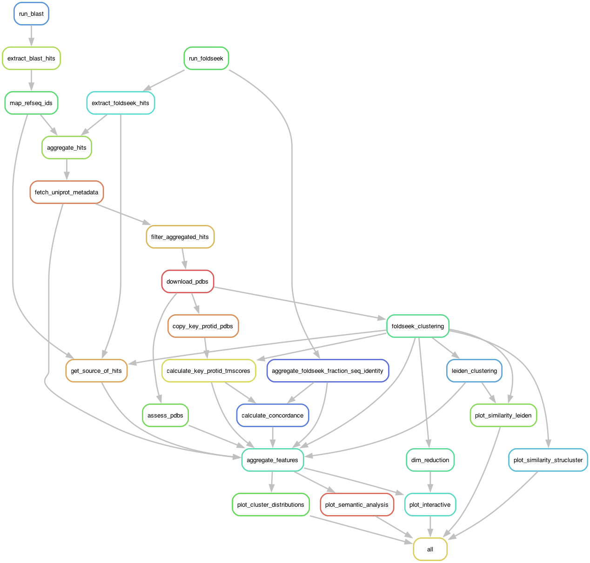

# ProteinCartography

[](https://doi.org/10.5281/zenodo.8377393)
[![Arcadia Pub](https://img.shields.io/badge/Arcadia-Pub-596F74.svg?logo=data:image/svg%2bxml;base64,PD94bWwgdmVyc2lvbj0iMS4wIiBlbmNvZGluZz0idXRmLTgiPz4KPCEtLSBHZW5lcmF0b3I6IEFkb2JlIElsbHVzdHJhdG9yIDI3LjcuMCwgU1ZHIEV4cG9ydCBQbHVnLUluIC4gU1ZHIFZlcnNpb246IDYuMDAgQnVpbGQgMCkgIC0tPgo8c3ZnIHZlcnNpb249IjEuMSIgaWQ9IkxheWVyXzEiIHhtbG5zPSJodHRwOi8vd3d3LnczLm9yZy8yMDAwL3N2ZyIgeG1sbnM6eGxpbms9Imh0dHA6Ly93d3cudzMub3JnLzE5OTkveGxpbmsiIHg9IjBweCIgeT0iMHB4IgoJIHZpZXdCb3g9IjAgMCA0My4yIDQwLjQiIHN0eWxlPSJlbmFibGUtYmFja2dyb3VuZDpuZXcgMCAwIDQzLjIgNDAuNDsiIHhtbDpzcGFjZT0icHJlc2VydmUiPgo8c3R5bGUgdHlwZT0idGV4dC9jc3MiPgoJLnN0MHtmaWxsOm5vbmU7c3Ryb2tlOiNGRkZGRkY7c3Ryb2tlLXdpZHRoOjI7c3Ryb2tlLWxpbmVqb2luOmJldmVsO3N0cm9rZS1taXRlcmxpbWl0OjEwO30KPC9zdHlsZT4KPGc+Cgk8cG9seWdvbiBjbGFzcz0ic3QwIiBwb2ludHM9IjIxLjYsMyAxLjcsMzcuNCA0MS41LDM3LjQgCSIvPgoJPGxpbmUgY2xhc3M9InN0MCIgeDE9IjIxLjYiIHkxPSIzIiB4Mj0iMjEuNiIgeTI9IjI3LjMiLz4KCTxwb2x5bGluZSBjbGFzcz0ic3QwIiBwb2ludHM9IjEyLjIsMTkuNCAyNC42LDMwLjEgMjQuNiwzNy40IAkiLz4KCTxsaW5lIGNsYXNzPSJzdDAiIHgxPSIxNy42IiB5MT0iMTYuNyIgeDI9IjE3LjYiIHkyPSIyNC4xIi8+Cgk8bGluZSBjbGFzcz0ic3QwIiB4MT0iMjguNiIgeTE9IjE1LjIiIHgyPSIyMS43IiB5Mj0iMjIuMSIvPgoJPHBvbHlsaW5lIGNsYXNzPSJzdDAiIHBvaW50cz0iNi44LDI4LjcgMTkuNSwzNC40IDE5LjUsMzcuNCAJIi8+Cgk8bGluZSBjbGFzcz0ic3QwIiB4MT0iMzQuOCIgeTE9IjI1LjgiIHgyPSIyNC42IiB5Mj0iMzYuMSIvPgoJPGxpbmUgY2xhc3M9InN0MCIgeDE9IjI5LjciIHkxPSIyMi4yIiB4Mj0iMjkuNyIgeTI9IjMwLjkiLz4KPC9nPgo8L3N2Zz4K)](https://doi.org/10.57844/arcadia-a5a6-1068)
[](https://docs.conda.io/en/latest/)
[](https://snakemake.readthedocs.io/en/stable/)


The ProteinCartography pipeline searches sequence and structure databases for matches to input proteins and builds maps of protein space for the purposes of discovery and exploration.

You can find a general overview of the pipeline in the Pub [![Arcadia Pub](https://img.shields.io/badge/Arcadia-Pub-596F74.svg?logo=data:image/svg%2bxml;base64,PD94bWwgdmVyc2lvbj0iMS4wIiBlbmNvZGluZz0idXRmLTgiPz4KPCEtLSBHZW5lcmF0b3I6IEFkb2JlIElsbHVzdHJhdG9yIDI3LjcuMCwgU1ZHIEV4cG9ydCBQbHVnLUluIC4gU1ZHIFZlcnNpb246IDYuMDAgQnVpbGQgMCkgIC0tPgo8c3ZnIHZlcnNpb249IjEuMSIgaWQ9IkxheWVyXzEiIHhtbG5zPSJodHRwOi8vd3d3LnczLm9yZy8yMDAwL3N2ZyIgeG1sbnM6eGxpbms9Imh0dHA6Ly93d3cudzMub3JnLzE5OTkveGxpbmsiIHg9IjBweCIgeT0iMHB4IgoJIHZpZXdCb3g9IjAgMCA0My4yIDQwLjQiIHN0eWxlPSJlbmFibGUtYmFja2dyb3VuZDpuZXcgMCAwIDQzLjIgNDAuNDsiIHhtbDpzcGFjZT0icHJlc2VydmUiPgo8c3R5bGUgdHlwZT0idGV4dC9jc3MiPgoJLnN0MHtmaWxsOm5vbmU7c3Ryb2tlOiNGRkZGRkY7c3Ryb2tlLXdpZHRoOjI7c3Ryb2tlLWxpbmVqb2luOmJldmVsO3N0cm9rZS1taXRlcmxpbWl0OjEwO30KPC9zdHlsZT4KPGc+Cgk8cG9seWdvbiBjbGFzcz0ic3QwIiBwb2ludHM9IjIxLjYsMyAxLjcsMzcuNCA0MS41LDM3LjQgCSIvPgoJPGxpbmUgY2xhc3M9InN0MCIgeDE9IjIxLjYiIHkxPSIzIiB4Mj0iMjEuNiIgeTI9IjI3LjMiLz4KCTxwb2x5bGluZSBjbGFzcz0ic3QwIiBwb2ludHM9IjEyLjIsMTkuNCAyNC42LDMwLjEgMjQuNiwzNy40IAkiLz4KCTxsaW5lIGNsYXNzPSJzdDAiIHgxPSIxNy42IiB5MT0iMTYuNyIgeDI9IjE3LjYiIHkyPSIyNC4xIi8+Cgk8bGluZSBjbGFzcz0ic3QwIiB4MT0iMjguNiIgeTE9IjE1LjIiIHgyPSIyMS43IiB5Mj0iMjIuMSIvPgoJPHBvbHlsaW5lIGNsYXNzPSJzdDAiIHBvaW50cz0iNi44LDI4LjcgMTkuNSwzNC40IDE5LjUsMzcuNCAJIi8+Cgk8bGluZSBjbGFzcz0ic3QwIiB4MT0iMzQuOCIgeTE9IjI1LjgiIHgyPSIyNC42IiB5Mj0iMzYuMSIvPgoJPGxpbmUgY2xhc3M9InN0MCIgeDE9IjI5LjciIHkxPSIyMi4yIiB4Mj0iMjkuNyIgeTI9IjMwLjkiLz4KPC9nPgo8L3N2Zz4K)](https://doi.org/10.57844/arcadia-a5a6-1068) for this pipeline. The results of a 25-protein meta-analysis of top-studied human proteins can be found on Zenodo [](https://doi.org/10.5281/zenodo.8377393).

## Purpose

Comparing protein structures across organisms can help us generate interesting biological hypotheses. This pipeline allows users to build interactive maps of structurally similar proteins useful for discovery and exploration.

Our pipeline starts with user-provided protein(s) of interest and searches the available sequence and structure databases for matches. Using the full list of matches, we can build a "map" of all the similar proteins and look for clusters of proteins with similar features. Overlaying a variety of different parameters such as taxonomy, sequence divergence, and other features onto these spaces allows us to explore the features that drive differences between clusters.

Because this tool is based on global structural comparisons, note that the results are not always useful for long proteins (>1200 amino acids), multi-domain proteins, or proteins with large unstructured regions. Additionally, while we find that the results for average length, well-structured proteins appear generally as expected, we have not yet comprehensively validated the clustering parameters, so users may find that different parameters work better for their specific analyses.

## Quickstart

The ProteinCartography pipeline supports Linux and macOS operating systems; it does not work on Windows. It also requires that you have `conda` or `mamba` installed. If you have an M series Mac, you will need to install an x86-64 version of `conda`. See [below](#running-the-pipeline-on-an-m-series-mac) for some tips on how to do this.

1. Clone the GitHub repository.
    ```
    git clone https://github.com/Arcadia-Science/ProteinCartography.git
    ```

2. Install [`conda`](https://conda.io/projects/conda/en/latest/user-guide/install/index.html) and/or [`mamba`](https://github.com/mamba-org/mamba) if you don't already have them installed.

3. Create a conda environment containing the software needed to run the pipeline.
    Run this code from within the ProteinCartography repo:
    ```
    conda env create -f envs/cartography_tidy.yml -n cartography_tidy
    conda activate cartography_tidy
    ```
4. Run the Snakemake pipeline using a demo protein (human ACTB, [P60709](https://www.uniprot.org/UniProtkb/P60709/entry)). Set `n` to be the number of cores you'd like to use for running the pipeline.

    ```
    snakemake --snakefile Snakefile --configfile demo/search-mode/config_actin.yml --use-conda --cores n
    ```

5. Inspect results. In the `demo/output/final_results/` directory, you should find the following files:

    - `actin_aggregated_features.tsv`: metadata file containing protein feature hits
    - `actin_aggregated_features_pca_umap.html`: interactive UMAP scatter plot of results
    - `actin_aggregated_features_pca_tsne.html`: interactive t-SNE scatter plot of results
    - `actin_leiden_similarity.html`: mean cluster TM-score similarity heatmap
    - `actin_semantic_analysis.html` and `actin_semantic_analysis.pdf`: simple semantic analysis of clusters

## Compute Specifications

We have been able to successfully run the pipeline on macOS and Amazon Linux 2 machines with at least 8GB RAM and 8 cores.

For the data generated for our pub, we ran the pipeline on an AWS EC2 instance of type `t2.2xlarge` (32 GiB RAM + 8 vCPU).

## Running the pipeline on an M-series Mac

To run the pipeline on an M-series Mac (with arm64 architecture), you will need to install an x86-64 version of `conda`. One way to do this is to install Miniconda using the x86-64 `.pkg` installer from the [miniconda website](https://docs.anaconda.com/free/miniconda/). Your Mac should recognize that the installer is for x86-64 and automatically use Rosetta 2 to run it. Alternatively, you can run the `conda` installer script from the command line with the `arch -x86_64` command. For example:

```bash
curl -O  https://repo.anaconda.com/miniconda/Miniconda3-latest-MacOSX-x86_64.sh
arch -x86_64 /usr/bin/env bash Miniconda3-latest-MacOSX-x86_64.sh
```

The x86 version of `conda` will automatically install x86-64 versions of all packages. If you have already installed `conda` on your M-series Mac, be careful to install the x86 version in a different location. To check that you are using the correct version of `conda`, you can run `conda info` and look for the `platform` field in the output. It should say `osx-64`. 

## Modes

The pipeline supports two modes: **Search** and **Cluster**. Both modes are implemented in the same [`Snakefile`](Snakefile). The mode in which the pipeline runs is controlled by the `mode` parameter in the [`config.yml`](config.yml) file.

### Search Mode

In this mode, the pipeline starts with a set of input proteins of interest in PDB and FASTA format and performs broad BLAST and Foldseek searches to identify hits. The pipeline aggregates all hits, downloads PDBs, and builds a map.



#### Inputs

- Query protein files in FASTA and PDB format.
    - Each protein should have a unique protein identifier (`protid`).
    - The `protid` should be the prefix of the FASTA and PDB files (e.g. `P60709.fasta`, `P60709.pdb`).
    - Proteins provided as FASTAs <400aa in length will be folde automatically by the pipeline using the ESMFold API.
    - For proteins >400aa in length, we recommend using [ColabFold](https://github.com/sokrypton/ColabFold).
- Custom `config.yml` file.
    - [`config.yml`](config.yml) contains the default parameters of the pipeline, which are used if a custom file is not provided.
    - We recommend making a copy of this file and customizing the file to fit your search parameters.
    - Passing the path of the custom config file through the `--configfile` flag to Snakemake will overwrite the defaults in [`config.yml`](config.yml).
    - **Key Parameters:**
        - `input`: directory containing input PDBs and FASTAs.
        - `output`: directory where all pipeline outputs are placed.
        - `analysis_name`: nickname for the analysis, appended to important output files.
        - See [`config.yml`](config.yml) for additional parameters.
- (Optional) `features_override.tsv` file.
    - This file can be used to pass protein metadata for custom proteins not found in UniProt.
    - These proteins will not automatically have metadata retrieved, so providing this information is useful for visualizing custom input proteins.
    - The columns of this file are described in [Feature file main columns](#feature-file-main-columns).
    - It can also be used to overwrite metadata values for specific proteins.

#### Walkthrough

0. Follow steps 1-3 in the [Quickstart](#quickstart) section above to set up and activate the conda environment.
1. Set up a [`config.yml`](config.yml) file specifying input and output directories and an analysis name.
2. Add query protein files in FASTA and PDB format to the input folder.
    - You can pull down proteins with a UniProt accession number and AlphaFold structure using the following command.
        Replace {accession} with your UniProt accession (e.g. P24928).
        `python ProteinCartography/fetch_accession.py -a {accession} -o input -f fasta pdb`
        This saves a FASTA file from UniProt and a PDB file from AlphaFold to the `input/` folder.
    - For non-UniProt proteins, users can provide a FASTA file (one entry per file).
        - If the protein is <400aa, the pipeline can generate a custom PDB file using the ESMFold API.
        - If the protein is >400aa, you should provide a PDB file with a matching prefix, which you can generate using ColabFold or other software.
3. Run this command, replacing the `config.yml` with your config file and `n` with the number of cores you want to allocate to Snakemake.
```
snakemake --configfile config.yml --use-conda --cores n
```

### Cluster Mode

In this mode, the pipeline starts with a folder containing PDBs of interest and performs just the clustering and visualization steps of the pipeline, without performing any searches or downloads.


#### Inputs

- Input protein structures in PDB format.
    - Each protein should have a unique protein identifier (`protid`) which matches the PDB file prefix, as described for [Search mode](#search-mode).
    - The pipeline does not yet support proteins with multiple chains.
- `config.yml` file with custom settings.
    - [`config.yml`](config.yml) is an example file that contains the defaults of the pipeline.
    - We recommend making a copy of this file and adjusting the settings.
    - A custom config file passed through the `--configfile` flag to Snakemake will overwrite the defaults.
    - **Key Parameters:**
        - `input`: directory containing input PDBs and FASTAs.
        - `output`: directory where all pipeline outputs are placed.
        - `analysis_name`: nickname for the analysis, appended to important output files.
        - `features_file`: path to features file (described below).
        - (Optional) `keyids`: a list of one or more key `protid` corresponding to the proteins to highlight in the output plots (similar to how the input proteins are highlighted in 'search' mode). Note: if not provided, the output directory `key_protid_tmscore_results` will be empty, as will the `protein_features/key_protid_tmscore_features.tsv` file.
        - See [`config.yml`](config.yml) for additional parameters.
- Features file with protein metadata.
    - Usually, we call this file `uniprot_features.tsv` but you can use any name.
    - The file should be placed into the `input` directory.
    - This file contains protein metadata for each protein used for visualization purposes.
    - The columns of this file are described in [Feature file main columns](#feature-file-main-columns).

#### Walkthrough

0. Follow steps 1-3 in the [Quickstart](#quickstart) section above to set up and activate the conda environment.
1. Set up a [`config.yml`](config.yml) file specifying input and output directories and an analysis name.
2. Add input protein structures in PDB format to your input folder.
    - The pipeline does not yet support PDBs with multiple chains.
3. Make a `uniprot_features.tsv` file.
    You can generate this one of two ways. If you have a list of UniProt accessions, you can provide that as a .txt file and automatically pull down the correct annotations. Alternatively, you can manually generate the file.
    - **3.1 Generating the file using `fetch_uniprot_metadata.py`**
        - Create a `uniprot_ids.txt` file that contains a list of UniProt accessions, one per line.
        - Run the following code from the base of the GitHub repository. Modify the input folder path to your input folder.
            ```
            python ProteinCartography/fetch_uniprot_metadata.py --input uniprot_ids.txt --output input/uniprot_features.tsv
            ```
    - **3.2 Manually generating the file**
        - For each protid in the dataset, you should gather relevant protein metadata.
        - The first column of the file should be the unique protein identifer, with `protid` as the column name.
        - You should have additional columns for relevant metadata as described in [Feature file main columns](#feature-file-main-columns).
        - Default columns that are missing will be ignored.
4. Run this command, replacing the `config.yml` with your config file and `n` with the number of cores you want to allocate to Snakemake.
```
snakemake --configfile config.yml --use-conda --cores n
```

## Directory Structure

- [Snakefile](Snakefile): the Snakemake pipeline that orchestrates this repo's functions.
- [config.yml](config.yml): default config file for the pipeline.
- [envs/](envs/): the conda environments used for this repo.
- [demo/](demo/): contains demo configs and input files for running the pipeline in both 'search' and 'cluster' modes.
- [ProteinCartography/](ProteinCartography/): scripts that are called by Snakemake, importable in Python.
- [pub/](pub/): files related to the ProteinCartography pub.

## Pipeline Overview

The **Search** mode of the pipeline performs all of the following steps.\
The **Cluster** mode starts at the "Clustering" step.

### Protein Folding

0. Fold input FASTA files using ESMFold.
    - The pipeline starts with input FASTA and/or PDB files, one entry per file, with a unique protein identifier (`protid`).
    - If a matching PDB file is not provided, the pipeline will use the ESMFold API to generate a PDB file for FASTA sequences shorter than 400aa.

### Protein Search

1. Search the AlphaFold databases using queries to the Foldseek webserver API for each provided `.pdb` file.
    - The pipeline searches `afdb50`, `afdb-proteome` and `afdb-swissprot` for each input protein and aggregate the results. You can customize to add or remove databases using the config file.
    - Currently, the pipeline is limited to retrieving a maximum of 1000 hits per protein, per database.

2. Search the non-redundant GenBank/RefSeq database using blastp for each provided `.fasta` file.
    - Takes the resulting output hits and maps each GenBank/RefSeq hit to a UniProt ID using `requests` and [the UniProt REST API](https://rest.uniprot.org/docs/?urls.primaryName=idmapping#/job/submitJob).
    - TODO: This can fail for large proteins (>700aa) due to remote BLAST CPU limits. To overcome this error, you can manually run BLAST locally or via the webserver and create an [accession list file](#accession-list-files-acc) with the name format `{protid}.blast_hits.refseq.txt` in the `output/blast_results/` directory.

### Download Data

3. Aggregate the list of Foldseek and BLAST hits from all input files into a single list of UniProt IDs.

4. Download annotation and feature information for each hit protein from UniProt.

5. Filter proteins based on key UniProt metadata. The pipeline removes:
    - Proteins marked as fragments by UniProt.
    - Deleted or outdated proteins.
    - Proteins larger than or smaller than user-specified maximum and minimum size parameters, specified in the `config.yml` file.

6. Download a `.pdb` file from each remaining protein from AlphaFold.
    - This part is a bit slow, as it's currently limited to the number of cores provided to Snakemake.
    - Sometimes this will fail, possibly due to rate limits. Restarting Snakemake with the `--rerun-incomplete` flag usually resolves this.

### Clustering

7. Generate a similarity matrix and cluster all protein .pdb files using Foldseek.
    - By default, `foldseek search` masks results with an e-value > 0.001. We set these masked values to 0.
    - By default, `foldseek search` returns at most 1000 hits per protein. For spaces where there are >1000 proteins, this results in missing comparisons. We also set missing values to 0.
    - When all hit proteins are highly similar, these settings can result in artefactually steep cutoffs in TM-score in the visualization. A TM-score of 0 in the scatter plot does not mean that there is no structural similarity - it instead is likely that the protein's structural similarity was not within the top 1000 hits. In the future, we plan to perform this filtering via e-value, and to re-calculate the TM-score for every input protein versus every hit to more accurately display in the visualization.

8. Perform dimensionality reduction and clustering on the similarity matrix.
    - By default, we perform 30-component PCA prior to running both TSNE and UMAP for visualization.
    - For clustering, we use the defaults of [`scanpy`'s Leiden clustering implementation](https://scanpy.readthedocs.io/en/latest/generated/scanpy.tl.leiden.html#scanpy-tl-leiden).

### Data Analysis and Aggregation

A note about nomenclature: the meaning of the phrase `key_protid` used in the filenames below is mode-dependent: in 'search' mode, the 'key' protids are simply the input protids, while in 'cluster' mode, the key protids are the protids specified in the `key_protids` list in the `config.yml` file.

9. Generate a variety of `*_features.tsv` files.
    - Each file has, as its first column, a list of protein ids (protid) that are shared between files.
    - We query UniProt to get all metadata from that service as a `uniprot_features.tsv` file.
    - Foldseek generates a `struclusters_features.tsv` file.
    - We perform Leiden clustering to generate a `leiden_features.tsv` file.
    - We use Foldseek to calculate the TM-score for the input protids (in search mode) or the 'key' protids (in cluster mode) versus all of the protids to generate a `key_protid_tmscore_features.tsv` file.
    - We extract from Foldseek search a fraction sequence identity for every protid in our input/key protids as `<key_protid>_fident_features.tsv` files.
    - We subtract the fraction sequence identity from the TM-score to generate a `<key_protid>_concordance_features.tsv` file.
    - We determine the source of each file in the analysis (whether it was found from blast or Foldseek) as the `source_features.tsv` file.

10. Aggregate features.
    - All of the `*_features.tsv` files are combined into one large `aggregated_features.tsv` file.

### Plotting

11. Calculate per-cluster structural similarities.
    - For every Leiden or Foldseek structural cluster of proteins, get the mean structural similarity within that cluster and between that cluster and every other cluster.
    - Plot it as a heatmap with suffix `_leiden_similarity.html` or `_structural_similarity.html`.

12. Perform simple semantic analysis on UniProt annotations.
    - For the annotations in each cluster, aggregate them and count the frequency of every full annotation string.
    - Perform a word count analysis on all of the annotations and generate a word cloud.
    - Save as a PDF file with suffix `_semantic_analysis.pdf`.

13. Perform simple statistical tests on the aggregated features and create a violin plot.
    - For every feature, perform a Mann-Whitney U test between the cluster containing each input protein (for Search mode) against each other cluster, or for each cluster against every other cluster (for Cluster mode).
    - Save the results as a `_distribution_analysis.svg` image file.

14. Build an explorable HTML visualization using `Plotly` based on the aggregated features.
    - An example can be found [here](examples/scatter.html)
    - Each point has hover-over information.
    - Default parameters include:
        - **Leiden Cluster:** Protein cluster as called by [scanpy's implementation of Leiden clustering](https://scanpy.readthedocs.io/en/stable/generated/scanpy.tl.leiden.html).
        - **Annotation Score:** [UniProt annotation score](https://www.uniprot.org/help/annotation_score) from 0 to 5 (5 being the best evidence).
        - **Broad Taxon:** the broad taxonomic category for the source organism. There are two modes: 'euk' and 'bac'.
            - Assigns the "smallest" taxonomic scope from the rankings below for each point. So, a mouse gene would get `Mammalia` but not `Vertebrata`.
            - For 'euk', uses the taxonomic groups `Mammalia, Vertebrata, Arthropoda, Ecdysozoa, Lophotrochozoa, Metazoa, Fungi, Viridiplantae, Sar, Excavata, Amoebazoa, Eukaryota, Bacteria, Archaea, Viruses`
            - For 'bac', uses the taxonomic groups `Pseudomonadota, Nitrospirae, Acidobacteria, Bacillota, Spirochaetes, Cyanobacteria, Actinomycetota, Deinococcota, Bacteria, Archaea, Viruses, Metazoa, Fungi, Viridiplantae, Eukaryota`
        - **Length:** length of the protein in amino acids.
        - **Source:** how the protein was added to the clustering space (`blast`, `foldseek` or `blast+foldseek`).

    - Power users can customize the plots using a variety of rules, described below.

## Plotting Rules for `plot_interactive()`

The `plot_interactive()` function has two required arguments:
- a path to the aggregated features file with coordinates that you'd like to plot
- a `plotting_rules` dictionary describing how the data should be plotted

The `plotting_rules` dictionary should have the following format.
Each column is an entry in the dictionary containing a dictionary of rules.

```
{
    'column1.name': {
        'type': 'categorical',
        'parameter1': value,
        'parameter2': value,
        ...
    }
    'column2.name': {
        'type': 'hovertext',
        ...
    }
}
```

The possible rules for each column are explained below.

### Rules for any plot type

- **'type' (required):**
    - `'categorical'`, `'continuous'`, `'taxonomic'`, or `'hovertext'`
    - Determines the plotting style of the data.
    - If 'categorical', expects the data to be in string format.
    - If 'continuous', expects the data to be in numerical (int or float) format.
    - If 'taxonomic', expects an ordered list of taxa to be used for grouping.
    - If 'hovertext', won't plot the data as a dropdown menu option, but will include the data in the hover-over text box.
- **'fillna':**
    - A value to fill rows that are `np.nan`.
    - For categorical plots, usually empty string `''`.
    - For continuous plots, usually `0`.
- **'apply':**
    - A function that will be applied to every element of the feature before plotting.
    - This can be used to convert a numerical value into a categorical value with a lambda function.
    - For example, `lambda x: str(x)`
- **'skip_hover':**
    - Boolean, whether to include this data in the hovertext.
- **'textlabel':**
    - A string that replaces the column name on buttons and in hover text.
    - Useful if the column name is too ugly.

### Rules for 'continuous' plots

- **'color_scale':**
    - A [named Plotly colorscale](https://plotly.com/python/builtin-colorscales/), or:
    - A [list of lists that can be converted into a Plotly colorscale](https://plotly.com/python/colorscales/#explicitly-constructing-a-color-scale) (don't use tuples).
- **'cmin':**
    - Minimum value to use for color scale. Defaults to minimum value for that column.
- **'cmax':**
    - Maximum value to use for color scale. Defaults to maximum value for that column.
- Note: if the value of 'fillna' is lower than the cmin, na values will have their own light grey coloration, distinct from the rest of the color scale.
  Good for indicating values that are missing, rather than actually calculated.

### Rules for 'categorical' and 'taxonomic' plots

- **'color_order':**
    - A list of HEX code colors used for coloring categorical variables.
    - If there aren't enough colors for unique values of the data, will generate up to 3x more colors of varying darkness.
- **'color_dict':**
    - A dictionary of key: value pairs for coloring categorical variables.
    - The key is the name of the category and the value is a HEX code color.

### Rules for 'taxonomic' plots

- **'taxon_order':**
    - Exclusively used for 'taxonomic' style plots. A list of ranked-order taxa for categorization.
    - Should start with more-specific taxa and expand to less-specific taxa.

## File Conventions

The pipeline generates a large number of .txt and .tsv files with specific formatting expectations.
Many of the pipeline's scripts accept these specific format conventions as input or return them as output.
These are the primary formats and their descriptions.

### Accession list files (ACC)

These files end with `'.txt'` and contain a list of accessions (RefSeq, GenBank, UniProt), one per line.

- **Example:**
    ```
    A0A2J8L4A7
    K7EV54
    A0A2J8WJR8
    A0A811ZNA7
    ...
    ```
- **Input to:**
    - [`aggregate_hits.py`](ProteinCartography/aggregate_hits.py)
    - [`get_source_of_hits.py`](ProteinCartography/get_source_of_hits.py)
    - [`map_refseq_ids.py`](ProteinCartography/map_refseq_ids.py)
    - [`fetch_uniprot_metadata.py`](ProteinCartography/fetch_uniprot_metadata.py)
- **Output from:**
    - [`aggregate_hits.py`](ProteinCartography/aggregate_hits.py)
    - [`extract_blast_hits.py`](ProteinCartography/extract_blast_hits.py)
    - [`extract_foldseek_hits.py`](ProteinCartography/extract_foldseek_hits.py)
    - [`map_refseq_ids.py`](ProteinCartography/map_refseq_ids.py)

### Matrix File (MTX)

These files end with `'.tsv'` and contain distance or similarity matrices, usually all-v-all.

- **Example:**
    | protid | A0A2J8L4A7 | K7EV54 | A0A2J8WJR8 | A0A811ZNA7 |
    |-------:|:----------:|:------:|:----------:|:----------:|
    | A0A2J8L4A7 |  1   | 0.9  | 0.85 | 0.7  |
    | K7EV54     | 0.9  |  1   | 0.91 | 0.6  |
    | A0A2J8WJR8 | 0.85 | 0.91 |  1   | 0.71 |
    | A0A811ZNA7 | 0.7  | 0.6  | 0.71 |  1   |
- **Input to:**
    - [`plot_cluster_similarity.py`](ProteinCartography/plot_cluster_similarity.py)
    - [`dim_reduction.py`](ProteinCartography/dim_reduction.py)
- **Output from:**
    - [`foldseek_clustering.py`](ProteinCartography/foldseek_clustering.py)

### Features files (FTF)

These files end with `'.tsv'` and contain a `protid` column, which is the unique identifier of each protein in the dataset.
The remaining columns are metadata for each protein. These metadata can be of any data type.

- **Example:**
    | protid | Length | LeidenCluster | Organism |
    |-------:|:---------------:|:-------------:|:-----------------------:|
    | A0A2J8L4A7 | 707 | 1 | Pan troglodytes (Chimpanzee) |
    | K7EV54 | 784 | 2 | Pongo abelii (Sumatran orangutan) |
    | A0A2J8WJR8 | 707 | 1 | Pongo abelii (Sumatran orangutan) |
    | A0A811ZNA7 | 781 | 1 | Nyctereutes procyonoides (Raccoon dog) |
- **Input to:**
    - [`aggregate_features.py`](ProteinCartography/aggregate_features.py)
    - [`calculate_convergence.py`](ProteinCartography/calculate_convergence.py)
    - [`dim_reduction.py`](ProteinCartography/dim_reduction.py)
    - [`plot_interactive.py`](ProteinCartography/plot_interactive.py)
    - [`semantic_analysis.py`](ProteinCartography/semantic_analysis.py)
- **Output from:**
    - [`aggregate_fident.py`](ProteinCartography/aggregate_fident.py)
    - [`calculate_convergence.py`](ProteinCartography/calculate_convergence.py)
    - [`calculate_key_protid_tmscores.py`](ProteinCartography/calculate_key_protid_tmscores.py)
    - [`foldseek_clustering.py`](ProteinCartography/foldseek_clustering.py)
    - [`get_source_of_hits.py`](ProteinCartography/get_source_of_hits.py)
    - [`leiden_clustering.py`](ProteinCartography/leiden_clustering.py)
    - [`fetch_uniprot_metadata.py`](ProteinCartography/fetch_uniprot_metadata.py)

#### Feature file main columns

A variety of metadata features for each protein are usually pulled from UniProt for visualization purposes. An [example `features_file.tsv`](examples/features_file.tsv) is provided as part of the repo.

If you are providing a set of custom proteins (such as those not fetched from UniProt) when using the **Search** mode, you may want to include a `features_override.tsv` file that contains these features for your proteins of interest. This will allow you to visualize your protein correctly in the interactive HTML map. You can specify the path to this file using the `features_override_file` parameter in [`config.yml`](config.yml).

When using **Cluster** mode, you should provide protein metadata in a `uniprot_features.tsv` file; specify the path to this file using the `features_file` parameter in the [config file](config.yml).

Note that the `override_file` parameter also exists in the **Cluster** mode. The difference between `features_file` and `override_file` is that the former is used as the base metadata file (replacing the `uniprot_features.tsv` file normally retrieved from UniProt, whereas the latter is loaded after the base metadata file, *replacing* any information pulled from the `features_file`. In the **Search** mode, you can therefore use the `override_file` parameter to correct errors in metadata provided by UniProt or replace values for specific columns in the `uniprot_features.tsv` file that is retrieved by the pipeline.

For either custom proteins provided through `override_file` in either mode, or base metadata provided by `features_file` in **Cluster** mode, you should strive to include the default columns in the table below. Features used for color schemes in the default plotting rules are marked with *(Plotting)* below. Features used only for hover-over description are marked with *(Hovertext)*.

| feature | example | description | source |
|--------:|:-------:|:------------|:-------|
|`"protid"` | `"P42212"` | *(Required)* the unique identifier of the protein. Usually the UniProt accession, but can be any alphanumeric string | User-provided or UniProt |
|`"Protein names"`| `"Green fluorescent protein"` | *(Hovertext)* a human-readable description of the protein | UniProt |
|`"Gene Names (primary)"` | `"GFP"` | *(Hovertext)* a gene symbol for the protein | UniProt |
|`"Annotation"`| `5` | *(Plotting)* UniProt [Annotation Score](https://www.uniprot.org/help/annotation_score) (0 to 5) | UniProt |
|`"Organism"` | `"Aequorea victoria (Water jellyfish) (Mesonema victoria)"` | *(Hovertext)* Scientific name (common name) (synonyms) | UniProt |
|`"Taxonomic lineage"`|`"cellular organisms (no rank), Eukaryota (superkingdom), ... Aequoreidae (family), Aequorea (genus)"`| string of comma-separated `Lineage name (rank)` for the organism's full taxonomic lineage | UniProt |
|`"Lineage"`|`["cellular organisms", "Eukaryota", ... "Aequoreidae", "Aequorea"]` | *(Plotting)* ordered list of lineage identifiers without rank information, generated from `"Taxonomic lineage"` | ProteinCartography |
|`"Length"`| `238` | *(Plotting)* number of amino acids in protein | UniProt |

### `conda` Environments

The pipeline uses a variety of conda environments to manage software dependencies.
The major conda environments are:
- `cartography_tidy`: used to run the pipeline. Includes only dependencies necessary to start the snakemake pipeline, which builds additional environments as needed based on each rule.
- `cartography_dev`: used for development. Includes all dependencies for every of the snakemake pipeline and Python package dependencies together in one environment, plus dependencies for development support (e.g. `jupyter`, `ipython`) and experimental features not yet implemented in the main pipeline (e.g. `pytorch`).
- `cartography_pub`: used to run the Jupyter notebooks in the `pub/` directory. Includes just the dependencies needed to run the notebooks.

## Contributing

Please see the [contributing guidelines](CONTRIBUTING.md) for more information.
